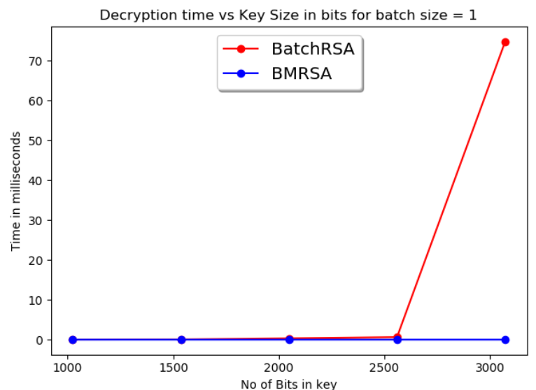
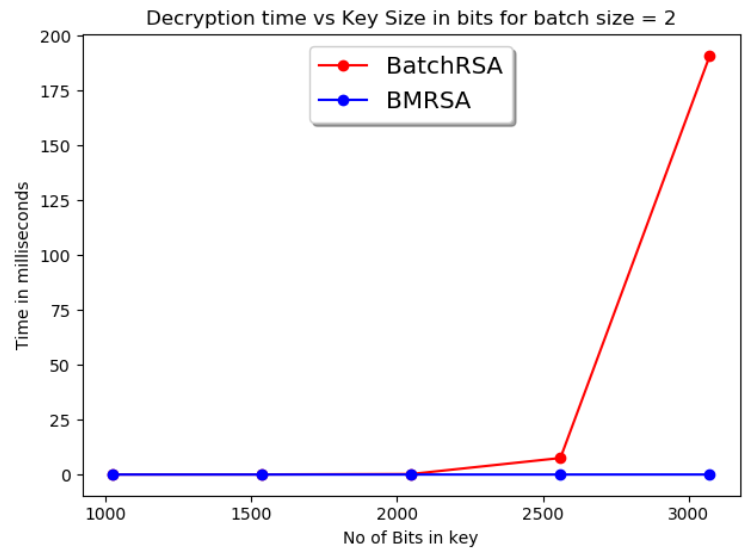
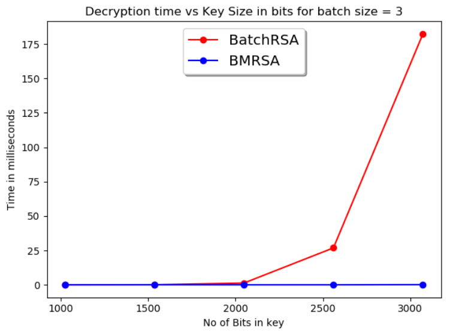

# The Batch Multi Prime RSA

***

## Algorithm

### 1. Set Up

* Compute b distinct primes P1....Pb which are (n/b) bits long

* Calculate phi and N.  
phi = (P1 - 1)*...(Pb - 1)  
N = P1*...Pb

* Taken l distinct and pairwise relatively prime public
keys e1,....,el as input. For each ei get di = ei-1mod(N).  
Computed = d1....dlmod(N)

### 2. Encryption
* For each message mi compute vi = miei mod(N).

### 3. Percolate Up
* Create a tree with leaves (V, E), where V = vi and E = ei and pass upwards.
* V = VREL * VLER
 and E = EL*ER
 
 ### 4. Exponentiation
* Calculate Cpi by the Cpi = V mod(Pi)

* Compute Mpi by the Mpi =Cpidpimod(Pi)

* Compute yp = N / Pi = P1P2....Pb and
ni = yi * yi-1 (mod Pi)

* Using the CRT to combine the Mi 's to obtain
r = Vd = Mpl*n1 + .... + Mpb*nb (mod N)

### 5. Percolate Down
* Use r as the root of the tree

* Find t = 0 mod EL and t = 1 mod ER. 
  tL = t / EL and  tR = (t-1)/R 
  Find rR = rt/(VLtL*VRtR) and 
  rL = r / rR
  
* What is present in the leaves will be messages

***

## File structure
* main.py : driver function
* mainBMRSA : here is where BMRSA is implemented
* mainBRSA : here is where BRSA is implemented
* useful/ funcs : useful functions like CRT, MMI are implemented here

***

## Results

* BMRSA is faster than BRSA which is evident from the graph below.  
The reason is due to *exponentiation step and tree making* which reduces the time needed for exponentiation

<b>Batch size is 1</b>

<b>Batch size is 2</b>

<b>Batch size is 3</b>
